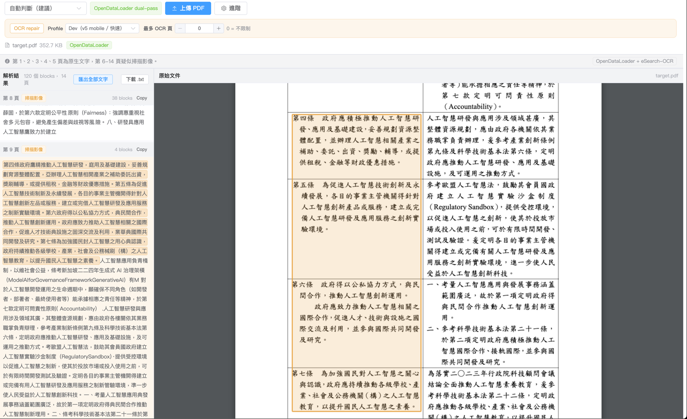
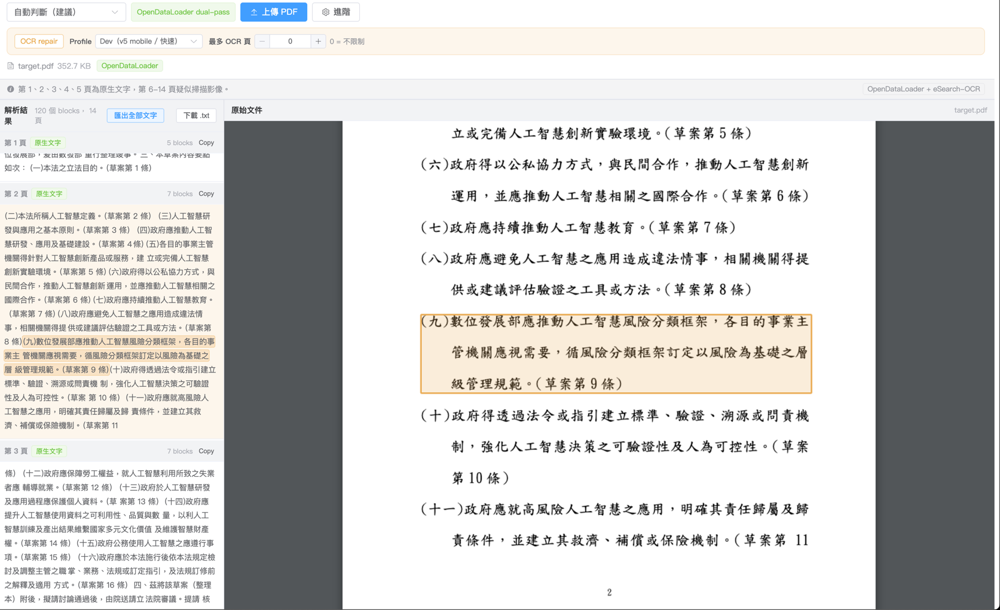

# PDF Parse PoC

[繁體中文](README.zh-TW.md)

ODL-first PDF ingestion PoC with optional eSearch-OCR v5 repair and a Vue preview/export UI.

## Note
The limitation of the experiment was to test whether there is a production-level PDF2Text tool in NodeJS libraries; the conclusion is that currently there isn't one; a hybrid approach is generally more ideal.
Here is a summary:
1. For pure CPU environments, standard PDFs (Word2PDF, printed PDFs) use OpenDataLoader; but the main issue is when scanning fails, requiring Mix Mode (Docling Server).
2. Initially considered using PaddleOCR CLI / Service to complete the task, but abandoned due to Python dependency concerns.
3. Later found Search-OCR as an implementation for NodeJS OCR, also utilizing PaddleOCR v5 Model.
4. However, in a pure CPU environment, only mobile models can be used; full models tend to be slow; and CoreML acceleration has issues.

Conclusion:
1. It’s best to deploy OCR as a standalone service so scaling won't be limited.
2. PaddleOCR v5 is very good and powerful, but VLM comparison has not been tried yet.

## Features

- Backend parser is fixed to OpenDataLoader.
- `pdfjs-dist` is used only for browser-side PDF preview.
- Optional page-level eSearch-OCR v5 repair for scanned, low-text, structural-hole, and table-like pages.
- Poppler `pdfinfo` / `pdftoppm` for preflight and OCR rasterization.
- OCR worker pool with bounded concurrency and persistent model loading.
- OCR post-processing:
  - two-column legal/table layout reconstruction,
  - OpenCC `s2tw.json`,
  - whitespace and punctuation cleanup.
- Vue UI:
  - upload and parse options,
  - OCR profile and page limit,
  - PDF preview with focused highlight,
  - per-page copy,
  - copy all text,
  - download `.txt`.

## UI

- OCR mode

  

- ODL mode

  

## Pipeline

```text
PDF upload
  -> Poppler preflight
  -> OpenDataLoader dual-pass parse
  -> SourceBlock normalization
  -> optional OCR repair
  -> layout/text cleanup
  -> preview and text export
```

## Requirements

- Node.js `>=20.20.0 <21`
- Java 11+
- Poppler `pdfinfo` and `pdftoppm`
- eSearch-OCR v5 model files

## Setup

```bash
npm install
npm run ocr:download-v5-mobile-models
ESEARCH_OCR_MODEL_DIR=models/esearch-ocr-v5-mobile OCR_MODEL_PROFILE=dev npm run ocr:check-env
```

For the larger v5 server model:

```bash
npm run ocr:download-v5-models
ESEARCH_OCR_MODEL_DIR=models/esearch-ocr-v5 OCR_MODEL_PROFILE=quality npm run ocr:check-env
```

`npm run ocr:download-models` still exists for legacy PP-OCRv2 assets, but the current flow should use v5 because v2 and v5 outputs differ.

## Run

```bash
ESEARCH_OCR_MODEL_DIR=models/esearch-ocr-v5-mobile \
OCR_MODEL_PROFILE=dev \
OCR_REPAIR_MAX_PAGES_IN_FLIGHT=1 \
npm run dev
```

Open `http://localhost:5173` and upload a PDF. In the UI, OCR page limit `0` means unlimited.

## Scripts

| Script | Purpose |
|---|---|
| `npm run dev` | Start Fastify and Vite |
| `npm run dev:server` | Start Fastify only |
| `npm run dev:web` | Start Vite only |
| `npm run typecheck` | TypeScript check |
| `npm run build` | Frontend production build |
| `npm run ocr:download-v5-mobile-models` | Download v5 mobile model |
| `npm run ocr:download-v5-models` | Download v5 server model |
| `npm run ocr:check-env` | Check OCR models and Poppler |

## Main OCR Env

| Variable | Purpose |
|---|---|
| `ESEARCH_OCR_MODEL_DIR` | OCR model directory |
| `OCR_MODEL_PROFILE` | `dev` or `quality` |
| `OCR_REPAIR_MAX_PAGES` | Max OCR pages; `0` means unlimited |
| `OCR_REPAIR_MAX_PAGES_IN_FLIGHT` | OCR page concurrency |
| `OCR_REPAIR_USE_WORKER_POOL` | Use child-process OCR workers |
| `OCR_REPAIR_PERSISTENT_WORKERS` | Keep workers alive across pages |
| `PDFINFO_PATH` / `PDFTOPPM_PATH` | Override Poppler binaries |

## API

### `POST /api/pdf/parse`

Multipart fields:

- `file`: PDF file
- `parseMode`: `auto | native_text | scanned_image | mixed_or_unknown`
- `advancedOptions`: JSON string

Example:

```json
{
  "enableComplexTableParsing": true,
  "enableOcrRepair": true,
  "ocrRepairProfile": "dev",
  "maxOcrPages": 0,
  "repairOnScanOrLowText": true,
  "repairOnStructuralHole": true
}
```

### `GET /api/pdf/:documentId/original`

Streams the uploaded PDF for preview.

## Scope

Included: ODL parsing, Poppler preflight/raster, eSearch-OCR v5 repair, OCR layout/text cleanup, SourceBlock provenance, Vue preview, copy/export text.

Not included: backend pdf.js parser, parser selector, rule candidate extraction, durable DB persistence, exact spreadsheet-like table modeling.
